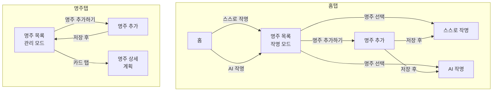

# Naming Studio — UI 스크린 플로우 (기획 스펙)

Cursor / Claude Code가 모바일 UI·네비게이션·플로우 작업 시 참고할 기준 문서입니다.

---

## 1. 개요

- **앱**: 한국어 아기 이름 작명 앱 (이름이 ✨).
- **기능**: AI 작명(채팅형), 스스로 작명(도구형), 저장된 이름 보기, 작명학 콘텐츠.
- **진입 구조**: 모든 작명(스스로/AI)은 **"어떤 사주(아이)에 대한 작명인지"**를 먼저 선택한 뒤 진행. 저장된 이름도 **사주별**로 관리.

---

## 2. 인증 정책

- **로그인 필수**: 유료 AI 이용·이름 저장·저장된 이름·결제·내 정보는 **로그인 필수**. 앱 삭제 후 재설치 시에도 계정으로 복구 가능해야 함.
- **소셜 로그인**: **애플**, **카카오** 두 가지만 지원.
  - iOS: 다른 소셜 로그인 제공 시 Sign in with Apple 필수 → 충족.
  - Android: 구글 로그인 필수 아님 → 애플·카카오만으로 스토어 심사 통과 가능.
- 이메일/비밀번호 회원가입은 선택 사항 또는 미제공.

---

## 3. 스크린 목록

### 3.1 현재 구현된 스크린

| 스크린      | 컴포넌트             | 설명                                                           |
| ----------- | -------------------- | -------------------------------------------------------------- |
| 홈          | `HomeScreen`         | 진입점. "AI와 함께 이름짓기" / "스스로 이름짓기" 카드.         |
| 명주 목록   | `MyeongJuListScreen` | 사용자가 등록한 명주(사주) 목록. 작명 모드 or 관리 모드.       |
| 명주 추가   | `AddMyeongJuScreen`  | 성별, 생년월일(음/양력), 출생시간, 출생지역 입력 후 저장.      |
| AI 작명     | `AINamingScreen`     | 채팅형 AI 작명. 결제 게이트·결제 유도 UI 있음.                 |
| 스스로 작명 | `SelfNamingScreen`   | 이름 입력 후 음양/오행/용신/수리격 등 분석 (NamingToolScreen). |

### 3.2 계획된 스크린

| 구분       | 스크린                | 설명                                                          |
| ---------- | --------------------- | ------------------------------------------------------------- |
| **명주**   | 명주 상세             | 명주 정보 보기·수정. (탭: 명주 → 카드 탭)                     |
| **인증**   | 로그인                | 애플·카카오 소셜 로그인.                                      |
|            | 회원가입              | 선택. (소셜만 사용 시 간단 가입 플로우 또는 생략)             |
| **저장**   | 저장된 이름 목록      | **사주별** 그룹/필터. 내가 저장한 이름 리스트.                |
|            | 저장된 이름 상세      | 한 이름 선택 시 상세(한자, 의미, 점수 요약 등).               |
| **결제**   | 결제 안내/플랜 선택   | AI 작명 이용 전 또는 payment_gate에서 "결제하고 계속하기" 시. |
|            | 결제 진행             | PG 연동 (웹뷰 또는 SDK).                                      |
|            | 결제 완료             | 성공 시 AI 작명 화면으로 복귀, `payment_complete` 호출.       |
| **콘텐츠** | 콘텐츠 목록           | "사용 방법", "작명학 알아보기" 등. 홈에서 진입.               |
|            | 콘텐츠 상세           | 음양조화, 오행조화, 수리격, 용신 등 관점별 정리.              |
| **내정보** | 내 정보(프로필)       | 로그인 시: 프로필, 구독/결제 이력 요약, 로그아웃.             |
|            | 설정                  | 선택. 알림, 테마, 언어 등.                                    |
| **기타**   | 스플래시              | 앱 실행 시. (선택: 자동 로그인 체크)                          |
|            | 온보딩                | 선택. 최초 실행 시 앱 소개.                                   |
|            | 약관/개인정보처리방침 | 회원가입 플로우 내.                                           |

---

## 4. 사주 기준 진입 플로우

작명(스스로/AI) 진입 시 **항상 명주 목록**을 거친다. 명주가 없으면 "명주 추가" 후 목록에서 선택.

```
[홈 탭에서 작명 시작]
1. 홈 → 스스로 작명 클릭 → 명주 목록 → 명주 선택 → 스스로 작명 화면
2. 홈 → 스스로 작명 클릭 → 명주 목록 → 명주 추가하기 → 명주 추가 → (저장 후 자동 진입) → 스스로 작명
3. 홈 → AI 작명 클릭 → 명주 목록 → 명주 선택 → AI 작명 화면
4. 홈 → AI 작명 클릭 → 명주 목록 → 명주 추가하기 → 명주 추가 → (저장 후 자동 진입) → AI 작명

[명주 탭에서 관리]
5. 명주 탭 → 명주 목록(관리) → 명주 추가 → 저장 후 목록 복귀
6. 명주 탭 → 명주 목록(관리) → 명주 카드 탭 → 명주 상세 (계획)
```



- **저장된 이름**: 사주 단위로만 노출. 예: "김○○ (2025.03.15 남)" 선택 시 해당 사주에 대한 저장 이름 목록.

---

## 5. 접근 제어

| 구분                   | 비로그인                | 로그인 후                              |
| ---------------------- | ----------------------- | -------------------------------------- |
| 홈                     | 진입 가능 (카드만 표시) | 동일                                   |
| 명주 목록 / 명주 추가  | —                       | 필요 (내 명주만 표시)                  |
| 스스로 작명            | —                       | 명주 선택 후 진입                      |
| AI 작명                | —                       | 명주 선택 후 진입, 결제 시 결제 플로우 |
| 이름 저장 (스스로/AI)  | —                       | 로그인 필수                            |
| 저장된 이름 목록/상세  | —                       | 로그인 필수                            |
| 결제                   | —                       | 로그인 필수                            |
| 콘텐츠 (사용법/작명학) | 열람 가능               | 동일                                   |
| 내 정보 / 설정         | 로그인 유도             | 로그인 필수                            |

---

## 6. 네비게이션 구조

- **하단 탭 (3탭)**: 홈 | 저장 | 내 정보
  - **홈**: 작명 진입. 콘텐츠(작명학)도 홈에서 보조 진입(InfoBanner/TipChips → ContentList).
  - **저장**: 내가 저장한 이름 목록·상세. 로그인 필수.
  - **내 정보**: 명주 목록 관리, 결제 내역, 설정, 로그아웃. 비로그인 시 로그인 유도.

### 탭별 Stack

- **홈 탭 (HomeStack)**
  `HomeScreen` → `MyeongJuListScreen (mode: ai|self)` → `AddMyeongJuScreen (mode: ai|self)` → `AINamingScreen | SelfNamingScreen`

- **저장 탭 (SavedStack)**
  `SavedNamesScreen` → `SavedNameDetailScreen (계획)`

- **내 정보 탭 (ProfileStack)**
  `MyProfileScreen` → `MyeongJuListScreen (manage mode)` → `AddMyeongJuScreen`
  `MyProfileScreen` → 결제 내역 (계획) | 설정 (계획)

- **결제**: 전역 모달 스택.
  `AINaming` 결제 게이트 → 결제 안내 → 결제 진행 → 결제 완료 → `AINaming` 복귀.

---

## 7. 저장·결제 플로우 요약

- **저장 트리거**
  - AI 작명: 채팅 내 NAME 블록마다 "저장" 버튼.
  - 스스로 작명: 분석 결과에 "이 이름 저장" 버튼.
    저장 시 현재 선택된 **명주(사주)**와 연결.
- **저장된 이름 목록**: 사주별 그룹/필터. 사주 선택 시 해당 사주에 저장된 이름만 표시.
- **결제**: AI 작명에서 `payment_required === true` 시 "결제하고 계속하기" → (로그인 확인) → 결제 안내 → PG → 결제 완료 → AINaming 복귀, `payment_complete` 호출.

---

## 8. 백엔드 연동 참고

- **현재**: [mobile/src/navigation/RootNavigator.tsx](../src/navigation/RootNavigator.tsx) — Bottom Tab 네비게이터. 4탭 각각 독립 Stack.
- **API**: [backend/api/routes.py](../../backend/api/routes.py) — `POST /api/chat`, `GET /api/session/{session_id}`, 한자/성씨 검색 등. 세션은 `session_id` 기준; `naming_sessions.user_id` 존재.
- **추가 필요**: 로그인(애플/카카오) 검증, 명주 CRUD, 저장된 이름 CRUD, 결제 검증(영수증/웹훅) 등은 백엔드 확장 필요.

---

## 9. 문서 위치

- 이 문서: `mobile/docs/UI_FLOW.md`
- 프로젝트 전체 가이드: 루트 `CLAUDE.md` (여기 문서 참조 링크 있음)
